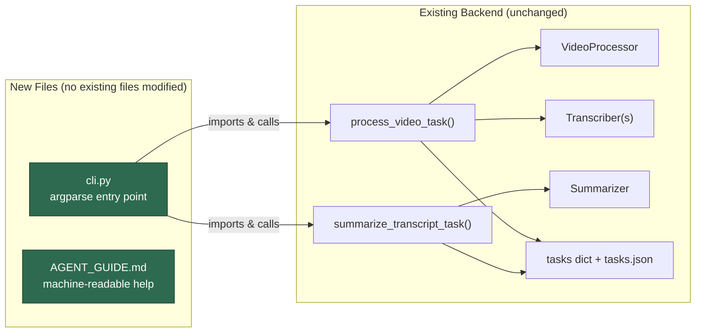

# CLI for AI Video Transcriber — Implementation Plan

Build a production-grade CLI (`cli.py`) that wraps the existing backend logic and exposes all transcription/summarization capabilities for programmatic use by AI agents, CI pipelines, and power users.

## Design Philosophy

The CLI will **directly reuse** the core async functions in `backend/main.py` (`process_video_task`, `summarize_transcript_task`) rather than calling the HTTP API, avoiding the need to start a web server. This is the lowest-friction approach: no code duplication, no serialization overhead, and guaranteed feature parity with the web UI.

The CLI will be a **single new file** (`cli.py`) at the project root — zero modifications to existing code.

## Resolved Design Decisions

| Decision | Choice |
|----------|--------|
| CLI library | `argparse` (stdlib, no new dependencies) |
| Default output | **JSON to stdout** for machine/agent consumption; `--pretty` flag for human-readable |
| Scope (v1) | Transcription + Summarization only (no `translate` subcommand) |
| API key sourcing | `--groq-api-key` flag + `GROQ_API_KEY` env var (flag wins); same pattern for OpenAI |
| File upload | `--file /path/to/audio` supported; passed directly to processing pipeline |
| Agent help | Dedicated `AGENT_GUIDE.md` + structured `--agent-help` output for AI agent discovery |

---

## Architecture Overview



---

## Proposed Changes

### Agent-Readable Help System

#### [NEW] [AGENT_GUIDE.md](file:///D:/Projects/AI-Video-Transcriber/AGENT_GUIDE.md)

A structured, machine-parseable guide specifically for AI agents. This is the primary document an agent reads to understand how to use the CLI. Contents:

```markdown
# AI Video Transcriber CLI — Agent Guide

## Capabilities
- transcribe: Convert video/audio URL or local file to text transcript
- summarize: Generate AI summary from transcript text
- pipeline: Transcribe + summarize in a single invocation
- tasks: List, inspect, or delete persisted task records

## Quick Reference

### transcribe
python cli.py transcribe --url <URL> --provider <groq|local|local_api> [options]
python cli.py transcribe --file <PATH> --provider <groq|local|local_api> [options]

### summarize
python cli.py summarize --task-id <ID> [options]
python cli.py summarize --transcript-file <PATH> [options]

### pipeline
python cli.py pipeline --url <URL> --provider <PROVIDER> --openai-api-key <KEY> [options]

### tasks
python cli.py tasks --list
python cli.py tasks --get <ID>
python cli.py tasks --delete <ID>

## All Flags (per subcommand)
<complete flag table with types, defaults, env var fallbacks>

## Output JSON Schema
<exact JSON structure returned by each command>

## Exit Codes
0 = success, 1 = error, 2 = invalid arguments

## Environment Variables
GROQ_API_KEY, OPENAI_API_KEY, OPENAI_BASE_URL

## Provider Decision Matrix
<when to use groq vs local vs local_api>

## Example Workflows
<concrete multi-step examples for common agent tasks>
```

#### `--agent-help` flag in cli.py

A built-in flag that prints a **JSON-structured capability manifest** to stdout — designed for agents that discover tools programmatically:

```bash
python cli.py --agent-help
```

Outputs:

```json
{
  "name": "ai-video-transcriber-cli",
  "version": "1.0.0",
  "description": "CLI for video/audio transcription and AI summarization",
  "guide": "AGENT_GUIDE.md",
  "commands": {
    "transcribe": {
      "description": "Transcribe video/audio to text",
      "required_one_of": ["--url", "--file"],
      "flags": {
        "--url": {"type": "string", "description": "Video URL (YouTube, etc.)"},
        "--file": {"type": "string", "description": "Local audio/video file path"},
        "--provider": {"type": "enum", "values": ["groq", "local", "local_api"], "default": "groq"},
        "--groq-api-key": {"type": "string", "env": "GROQ_API_KEY", "required_if": "provider=groq"},
        "--groq-model": {"type": "string", "default": "whisper-large-v3-turbo"},
        "--language": {"type": "string", "default": "auto"},
        "--include-timecodes": {"type": "boolean", "default": false},
        "--skip-subtitles": {"type": "boolean", "default": false},
        "--local-backend": {"type": "enum", "values": ["whisper", "parakeet"], "default": "whisper"},
        "--local-model": {"type": "string", "default": "base"},
        "--output": {"type": "string", "description": "Write transcript to file path"},
        "--format": {"type": "enum", "values": ["json", "markdown", "txt"], "default": "json"}
      },
      "output_schema": {
        "status": "string",
        "transcript": "string",
        "video_title": "string",
        "detected_language": "string",
        "transcript_source": "string"
      }
    },
    "summarize": {
      "description": "Generate AI summary from transcript",
      "required_one_of": ["--task-id", "--transcript-file"],
      "flags": {
        "--task-id": {"type": "string", "description": "Task ID from a prior transcribe run"},
        "--transcript-file": {"type": "string", "description": "Path to transcript text file"},
        "--openai-api-key": {"type": "string", "env": "OPENAI_API_KEY"},
        "--openai-base-url": {"type": "string", "env": "OPENAI_BASE_URL"},
        "--model": {"type": "string", "default": "gpt-4o"},
        "--language": {"type": "string", "default": "en"},
        "--output-format": {"type": "enum", "values": ["markdown", "html", "txt"], "default": "markdown"},
        "--output": {"type": "string", "description": "Write summary to file path"},
        "--prompt": {"type": "string", "description": "Custom summary instructions"},
        "--reasoning-effort": {"type": "enum", "values": ["none","minimal","low","medium","high","xhigh"], "default": ""}
      }
    },
    "pipeline": {
      "description": "Transcribe + summarize in one invocation",
      "notes": "Accepts all flags from both transcribe and summarize"
    },
    "tasks": {
      "description": "Manage persisted task records",
      "flags": {
        "--list": {"type": "boolean", "description": "List all tasks"},
        "--get": {"type": "string", "description": "Get task by ID"},
        "--delete": {"type": "string", "description": "Delete task by ID"}
      }
    }
  },
  "exit_codes": {"0": "success", "1": "runtime error", "2": "invalid arguments"},
  "env_vars": ["GROQ_API_KEY", "OPENAI_API_KEY", "OPENAI_BASE_URL"]
}
```

The standard `--help` / `-h` also includes a note directing agents to `--agent-help` for structured output.

---

### CLI Entry Point

#### [NEW] [cli.py](file:///D:/Projects/AI-Video-Transcriber/cli.py)

A single ~450-line file providing the full CLI interface.

**Subcommands:**

| Command | Description | Key Flags |
|---------|-------------|-----------|
| `transcribe` | Transcribe a video/audio | `--url`, `--file`, `--provider`, `--groq-api-key`, `--groq-model`, `--local-backend`, `--local-model`, `--language`, `--include-timecodes`, `--skip-subtitles`, `--output`, `--format` |
| `summarize` | Summarize an existing transcript | `--task-id`, `--transcript-file`, `--openai-api-key`, `--openai-base-url`, `--model`, `--language`, `--output-format`, `--output`, `--prompt`, `--reasoning-effort` |
| `pipeline` | Transcribe + summarize in one shot | All flags from both commands |
| `tasks` | List/inspect persisted tasks | `--list`, `--get <id>`, `--delete <id>` |

**Key implementation details:**

1. **Path setup & imports:**
   ```python
   PROJECT_ROOT = Path(__file__).resolve().parent
   sys.path.insert(0, str(PROJECT_ROOT / "backend"))
   ```
   Then import `main`, `process_video_task`, `summarize_transcript_task`, etc.

2. **Task state management:** The CLI creates a task entry in `main.tasks` (the in-memory dict) with a UUID, then calls `process_video_task()` synchronously via `asyncio.run()`. The `_push_task_update` / `broadcast_task_update` calls in `main.py` will harmlessly update the dict and attempt SSE broadcast (which will have no listeners — this is safe because `sse_connections` will be empty).

3. **Progress reporting:** Replace `broadcast_task_update` with a CLI-friendly callback using monkey-patching at startup, printing progress lines to stderr:
   ```
   [12%] Checking video subtitles...
   [45%] Audio URL resolved; sending to Groq transcription...
   [92%] Saving transcript files...
   [100%] Transcript complete.
   ```
   In `--quiet` mode, no progress is printed.

4. **Output handling:**
   - **JSON mode** (default): Print the full task dict as JSON to stdout
   - **`--output <path>`**: Write transcript/summary to a file
   - **`--format`**: Choose `markdown`, `txt`, `html`, or `json` for file output
   - **`--pretty`**: Human-readable formatted output to stdout

5. **Environment variable integration:**
   ```
   GROQ_API_KEY      → --groq-api-key
   OPENAI_API_KEY    → --openai-api-key / --api-key
   OPENAI_BASE_URL   → --openai-base-url / --base-url
   ```
   CLI flags override env vars. `.env` file is auto-loaded if present (simple manual parsing — no extra dependency).

6. **Error handling:** Non-zero exit codes for failures. Errors are printed to stderr. JSON mode outputs `{"error": "...", "exit_code": 1}`.

7. **File input support:** When `--file` is provided, the CLI copies it to `temp/` and passes `source_file_path` to `process_video_task()`, matching the web UI's upload flow.

**Example usage by AI agents:**

```bash
# Discover capabilities (machine-readable)
python cli.py --agent-help

# Basic transcription (Groq provider)
python cli.py transcribe --url "https://youtu.be/abc123" --groq-api-key "gsk-xxx"

# Local Whisper transcription, skip subtitles, output to file
python cli.py transcribe --url "https://youtu.be/abc123" \
    --provider local --local-backend whisper --local-model base \
    --skip-subtitles --output transcript.md

# Transcribe a local audio file
python cli.py transcribe --file recording.mp3 --provider groq --groq-api-key "gsk-xxx"

# Full pipeline: transcribe + summarize
python cli.py pipeline --url "https://youtu.be/abc123" \
    --groq-api-key "gsk-xxx" \
    --openai-api-key "sk-xxx" \
    --summary-language en --output-format markdown \
    --output ./output/

# Summarize an already-transcribed task
python cli.py summarize --task-id "abc-def-123" \
    --openai-api-key "sk-xxx" --language en

# Summarize from a transcript file (no prior task needed)
python cli.py summarize --transcript-file transcript.md \
    --openai-api-key "sk-xxx" --language en --output summary.md

# List all tasks
python cli.py tasks --list

# Get task details as JSON
python cli.py tasks --get "abc-def-123"
```

**Internal structure of `cli.py`:**

```
cli.py
├── AGENT_MANIFEST             # JSON dict for --agent-help output
├── _setup_path()              # sys.path manipulation
├── _load_env()                # .env file loading (manual parser)
├── _patch_broadcast()         # Replace SSE broadcast with CLI progress
├── _print_progress()          # stderr progress reporter
├── _output_result()           # JSON/pretty/file output handler
├── cmd_transcribe(args)       # transcribe subcommand
├── cmd_summarize(args)        # summarize subcommand  
├── cmd_pipeline(args)         # pipeline subcommand (transcribe + summarize)
├── cmd_tasks(args)            # task management subcommand
├── build_parser()             # argparse setup with rich epilog
└── main()                     # entry point (handles --agent-help)
```

---

### Tests

#### [NEW] [tests/test_cli.py](file:///D:/Projects/AI-Video-Transcriber/tests/test_cli.py)

Unit tests using `unittest` + mocks (consistent with existing test patterns in the project):

1. **Argument parsing:** Verify all flags are parsed correctly for each subcommand
2. **`--agent-help`:** Verify it outputs valid JSON with all required keys
3. **Transcribe command:** Mock `process_video_task`, verify it's called with correct kwargs
4. **Summarize command:** Mock `summarize_transcript_task`, verify correct kwargs
5. **Pipeline command:** Verify both are invoked in sequence with correct data flow
6. **Task listing:** Verify `--list`, `--get`, `--delete` against mock task store
7. **Output modes:** Test JSON stdout, `--output` file writing, `--pretty` formatting
8. **Error handling:** Missing required args, invalid providers, missing API keys → exit code 1
9. **Env var fallback:** Verify `GROQ_API_KEY` env var is used when `--groq-api-key` is omitted

---

### Agent Guide

#### [NEW] [AGENT_GUIDE.md](file:///D:/Projects/AI-Video-Transcriber/AGENT_GUIDE.md)

Comprehensive, structured documentation written specifically for AI agents. Contains:
- Capability enumeration with exact command signatures
- Complete flag reference table (types, defaults, env var fallbacks)
- Output JSON schemas for each command
- Exit code reference
- Provider decision matrix (when to pick groq vs local vs local_api)
- Step-by-step workflow examples for common tasks
- Error handling guidance

---

## Summary of New Files

| File | Purpose | Lines (est.) |
|------|---------|-------------|
| `cli.py` | CLI entry point with all subcommands | ~450 |
| `AGENT_GUIDE.md` | Machine/agent-readable guide | ~200 |
| `tests/test_cli.py` | Unit tests for CLI | ~300 |

**Existing files modified:** None.

---

## Verification Plan

### Automated Tests

```bash
# Run CLI unit tests
python -m pytest tests/test_cli.py -v

# Verify existing tests still pass (no regressions)
python -m pytest tests/ -v
```

### Manual Verification

- `python cli.py --help` → all subcommands documented, note about `--agent-help`
- `python cli.py --agent-help` → valid JSON manifest to stdout
- `python cli.py transcribe --help` → all flags documented
- `python cli.py tasks --list` → JSON array output
- Verify the web UI still works unchanged (no existing files modified)

### Integration Smoke Test (requires API keys)

```bash
python cli.py transcribe --url "https://youtu.be/dQw4w9WgXcQ" \
    --provider groq --groq-api-key "$GROQ_API_KEY"
```
