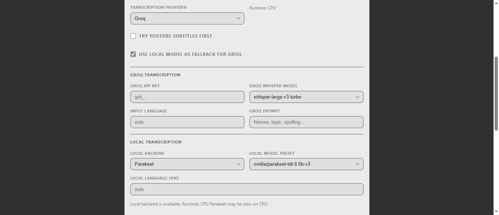

<div align="center">

# AI Video Transcriber

English | [дё­ж–‡](README_ZH.md)


An AI-powered tool to transcribe and summarize videos and podcasts — supports YouTube, TikTok, Bilibili, Apple Podcasts, SoundCloud, and 30+ platforms.



</div>

## Project Highlights

- Windows-first local setup and launcher flow
- Subtitle-first transcription with explicit provider selection
- Groq transcription, local Whisper/Parakeet support, and Groq-to-local fallback
- User-configurable summary provider via OpenAI-compatible APIs
- Additional transcript/summary export and UI workflow improvements

## вњЁ Features

- рџЋҐ **Multi-Platform Support**: Works with YouTube, TikTok, Bilibili, Apple Podcasts, SoundCloud, and 30+ more
- вљЎ **Optional Subtitle-First Architecture**: You can explicitly choose whether to try YouTube subtitles first before any transcription provider runs.
- рџ—ЈпёЏ **Selectable Transcription Provider**: Explicitly choose `Groq` or `Local` for transcription.
- рџ’» **Local Model Support**: Run local Faster-Whisper presets (`tiny`, `base`, `small`, `medium`, `large-v3`) or NVIDIA Parakeet presets (`nvidia/parakeet-tdt-0.6b-v3`, `nvidia/parakeet-tdt-0.6b-v2`), or point to a custom local model id/path.
- 📦 **Selected Model Auto-Install**: When you choose a local backend/model, the app installs missing backend packages and downloads that exact selected model automatically on first use.
- рџ”Ѓ **Groq в†’ Local Fallback**: Optionally fall back to the selected local backend when Groq fails with eligible transient/media-fetch errors.
- рџ¤– **Confirmed Summarization**: Summary generation is a separate user action, so transcript text is not sent to a summary provider until you click **Generate Summary**.
- рџЊЌ **Multi-Language Summaries**: Generate intelligent summaries in multiple languages
- 🔧 **Bring Your Own Model**: Configure any OpenAI-compatible API endpoint (OpenAI, OpenRouter, local LLM, etc.) directly in the UI — enter your API Base URL and API Key, then click **Fetch** to auto-discover all available models and select the one you want
- рџ“„ **Markdown and HTML Exports**: Save transcripts as Markdown and summaries as Markdown, HTML, or both
- рџ“± **Mobile-Friendly**: Perfect support for mobile devices


## рџљЂ Quick Start

### Prerequisites

- Windows 10
- Python 3.10+
- A Groq API key if you want Groq transcription
- An API key from any OpenAI-compatible provider for summaries (OpenAI, OpenRouter, etc.); this can be configured directly in the UI

### Installation

```powershell
cd D:\Projects\AI-Video-Transcriber
.\start_windows.bat
```

`start_windows.bat` supports explicit virtual-environment modes:

```powershell
.\start_windows.bat --venv auto   # default: use .venv if present, otherwise current Python
.\start_windows.bat --venv on     # create/use .venv and install dependencies there
.\start_windows.bat --venv off    # use the current Python interpreter without .venv
```

Manual Windows setup:

```powershell
cd D:\Projects\AI-Video-Transcriber
py -3 -m venv .venv
.\.venv\Scripts\activate
python -m pip install --upgrade pip
pip install -r requirements.txt
python start.py
```

Environment variables are optional. You can enter Groq and summary-provider keys directly in the browser UI.

### Start the Service

```powershell
python start.py
```

After the service starts, open your browser and visit `http://localhost:8001`

#### Production Mode (Recommended for long videos)

To avoid SSE disconnections during long processing, start in production mode (hot-reload disabled):

```powershell
python start.py --prod
```

This keeps the SSE connection stable throughout long tasks (30–60+ min).

#### Run with explicit env (example)

```powershell
.\.venv\Scripts\activate
$env:OPENAI_API_KEY="your_api_key_here"         # optional: server-side default
$env:OPENAI_BASE_URL="https://openrouter.ai/api/v1"  # optional: server-side default
python start.py --prod
```

## рџ“– Usage Guide

1. **Enter Video URL**: Paste a video link from YouTube, Bilibili, or other supported platforms
2. **Choose a Transcription Provider**: In **AI Settings**, select `Groq` or `Local`
3. **Choose Subtitle Behavior**: Leave `Try YouTube subtitles first` enabled for the fast path, or disable it to force the selected provider immediately
4. **Configure Provider Settings**:
   - **Groq**: add Groq API key, Groq model, and optional language/prompt
   - **Local**: choose `Whisper` or `Parakeet`, then select a preset or `Custom model`
   - **Fallback**: when provider=`Groq`, optionally enable local fallback
5. **Configure Summary Provider**: Add your OpenAI-compatible summary endpoint, API key, and model when you want AI summaries
6. **Start Processing**: Click the **Transcribe** button. The progress bar shows which mode is active:
   - **Subtitle** — native/manual or automatic subtitles were used
   - **Groq** — Groq handled transcription
   - **Local** — a local backend handled transcription
   - **Local fallback** — Groq failed on an eligible error and the app switched to the local backend
7. **Review Transcript**: The transcript is shown and saved before any summary request is made
8. **Generate Summary**: Choose Markdown, HTML, TXT, or Markdown + HTML, then click **Generate Summary**
9. **Download Files**: Save the transcript or summary from the UI in MD/TXT/PDF, and download generated summary artifacts where available

## рџ› пёЏ Technical Architecture

### Backend Stack
- **FastAPI**: Modern Python web framework
- **yt-dlp**: Subtitle extraction and direct audio URL resolution
- **Groq API**: Speech-to-text provider
- **faster-whisper**: Optional local Whisper backend
- **onnx-asr / Parakeet**: Optional local ONNX Parakeet backend
- **OpenAI-compatible API**: User-confirmed summarization

### Frontend Stack
- **HTML5 + CSS3**: Responsive interface design
- **JavaScript (ES6+)**: Modern frontend interactions
- **Marked.js**: Markdown rendering
- **Font Awesome**: Icon library

### Project Structure
```
AI-Video-Transcriber/
в”њв”Ђв”Ђ backend/                 # Backend code
в”‚   в”њв”Ђв”Ђ main.py             # FastAPI main application
в”‚   в”њв”Ђв”Ђ video_processor.py  # Video processing module
в”‚   в”њв”Ђв”Ђ groq_transcriber.py # Groq URL transcription module
в”‚   в”њв”Ђв”Ђ html_export.py      # Standalone HTML export module
в”‚   в”њв”Ђв”Ђ summarizer.py       # Summary module
в”‚   в””в”Ђв”Ђ translator.py       # Translation module
в”њв”Ђв”Ђ static/                 # Frontend files
в”‚   в”њв”Ђв”Ђ index.html          # Main page
в”‚   в””в”Ђв”Ђ app.js              # Frontend logic
в”њв”Ђв”Ђ temp/                   # Temporary files directory
в”њв”Ђв”Ђ .env.example            # Environment variables template
в”њв”Ђв”Ђ requirements.txt        # Python dependencies
в”њв”Ђв”Ђ start.py               # Startup script
в”њв”Ђв”Ђ start_windows.bat      # Windows launcher
в””в”Ђв”Ђ README.md              # Project documentation
```

## вљ™пёЏ Configuration Options

### Environment Variables

| Variable | Description | Default | Required |
|----------|-------------|---------|----------|
| `OPENAI_API_KEY` | API key (server-side default) | - | No — can be set in UI instead |
| `HOST` | Server address | `0.0.0.0` | No |
| `PORT` | Server port | `8001` | No |

### Local Backend Notes

- The app detects CUDA automatically and uses it when available.
- The server does not require a virtual environment at runtime. It runs in whichever Python interpreter starts `start.py`.
- The Windows launcher lets you choose whether dependencies are installed into `.venv` or your current Python environment.
- Whisper can run on CPU or CUDA.
- Parakeet now uses `onnx-asr` with ONNX Runtime instead of the old NeMo/PyTorch path.
- The app prefers the ONNX `int8` Parakeet model on first load to keep RAM use down.
- Parakeet can also run on CPU, but it may still be slower than Groq or local Whisper; the UI surfaces that warning.
- Missing local backend packages are installed automatically when you actually run the selected local backend.
- The exact selected local model is downloaded automatically on first use and then reused from cache.
- Local custom models are passed through as-is. If a backend/model does not expose timestamps, transcription still succeeds and the app returns transcript text without timecodes.

### Groq Whisper Model Options

| Model | Use Case |
|-------|----------|
| `whisper-large-v3-turbo` | Default fast transcription fallback |
| `whisper-large-v3` | Higher-accuracy multilingual transcription and translation support |

## 🔧 FAQ

### Q: Why is transcription slow?
A: Subtitle extraction is usually fast. Groq speed depends on video length, temporary media URL fetches, and provider response time. Local Whisper/Parakeet speed depends heavily on CPU vs CUDA.

### Q: Which video platforms are supported?
A: All platforms supported by yt-dlp, including but not limited to: YouTube, TikTok, Facebook, Instagram, Twitter, Bilibili, Youku, iQiyi, Tencent Video, etc.

### Q: What if the AI optimization features are unavailable?
A: AI features require an API key from any OpenAI-compatible provider (OpenAI, OpenRouter, etc.). You can enter it directly in the **AI Settings** panel in the UI — no server restart needed. Alternatively, set `OPENAI_API_KEY` as an environment variable for a server-side default.

### Q: I get HTTP 500 errors when starting/using the service. Why?
A: In most cases this is an environment configuration issue rather than a code bug. Please check:
- Install dependencies into the same Python interpreter that starts the app. The simplest path is one of:
  - `.\start_windows.bat --venv on`
  - `.\start_windows.bat --venv off`
  - or manual setup with `.\.venv\Scripts\activate` followed by `pip install -r requirements.txt`
- Configure your API key in the **AI Settings** panel, or set `OPENAI_API_KEY` as an env var
- If port 8001 is occupied, stop the old process or change `PORT`

### Q: Do I still need Microsoft C++ Build Tools for Parakeet?
A: Not for the default local Parakeet path in this fork. The app now uses the ONNX-based `onnx-asr` backend instead of the older NeMo dependency chain, so the Windows Build Tools workaround is no longer part of the normal Parakeet setup.

### Q: How to handle long videos?
A: The app can try subtitles first, then use Groq or a local model based on your settings. If Groq is selected, Groq file/URL limits and YouTube URL expiry can still apply; local fallback can help when the failure is transient and eligible.

### Q: How to use Docker for deployment?
A: This Windows 10 setup intentionally does not use Docker. Use `start_windows.bat` or `python start.py`.

### Q: What are the memory requirements?
A: The FastAPI server itself is lightweight. Memory use rises if you enable local backends, especially larger Whisper models. The ONNX Parakeet backend is materially lighter than the old NeMo/PyTorch path, but CPU-only Parakeet can still be slow on long videos.

### Q: Network connection errors or timeouts?
A: If you encounter network-related errors during video downloading or API calls, try these solutions:

**Common Network Issues:**
- Subtitle extraction or direct audio URL resolution fails
- Groq cannot fetch the temporary audio URL before it expires
- OpenAI-compatible API calls return connection timeout or DNS resolution failures

**Solutions:**
1. **Switch VPN/Proxy**: Try connecting to a different VPN server or switch your proxy settings
2. **Check Network Stability**: Ensure your internet connection is stable
3. **Retry After Network Change**: Wait 30-60 seconds after changing network settings before retrying
4. **Use Alternative Endpoints**: If using custom OpenAI endpoints, verify they're accessible from your network
5. **Retry Fresh URL Resolution**: Re-run transcription so `yt-dlp` resolves a fresh temporary audio URL

**Quick Network Test:**
```bash
# Test video platform access
curl -I https://www.youtube.com/

# Test your AI provider endpoint
curl -I https://openrouter.ai
```

## рџЋЇ Supported Languages

### Transcription
- YouTube subtitle languages depend on the video's available manual or automatic captions
- Groq Whisper fallback supports multilingual speech-to-text
- Automatic language detection
- High accuracy for major languages

### Summary Generation
- English
- Chinese (Simplified)
- Japanese
- Korean
- Spanish
- French
- German
- Portuguese
- Russian
- Arabic
- And more...

## рџ“€ Performance Tips

- **Hardware Requirements**:
  - Minimum: 4GB RAM, dual-core CPU
  - Recommended: 8GB RAM, quad-core CPU
  - Ideal: 16GB RAM, multi-core CPU, SSD storage

- **Processing Time Estimates**:

  | Video Length | Subtitle Mode | Groq URL Mode | Notes |
  |-------------|---------------|---------------|-------|
  | 1 minute | ~5s | Usually seconds | Subtitle mode needs no audio URL |
  | 5 minutes | ~10s | Usually under a minute | Depends on Groq and the temporary URL |
  | 15 minutes | ~15s | Usually minutes | Summary is a separate confirmed step |
  | 30+ minutes | ~20s | Depends on API limits | Groq URL/file limits can apply |

## рџ¤ќ Contributing

We welcome Issues and Pull Requests!

1. Fork the project
2. Create a feature branch (`git checkout -b feature/AmazingFeature`)
3. Commit your changes (`git commit -m 'Add some AmazingFeature'`)
4. Push to the branch (`git push origin feature/AmazingFeature`)
5. Open a Pull Request


## Acknowledgments

- [yt-dlp](https://github.com/yt-dlp/yt-dlp) - Subtitle and direct media URL extraction
- [Groq](https://groq.com/) - Fast speech-to-text API
- [FastAPI](https://fastapi.tiangolo.com/) - Modern Python web framework
- [OpenAI](https://openai.com/) - Intelligent text processing API

## рџ“ћ Contact

For questions or suggestions, please submit an Issue or contact Wendy.

---


## в­ђ Star History

If you find this project helpful, please consider giving it a star!
